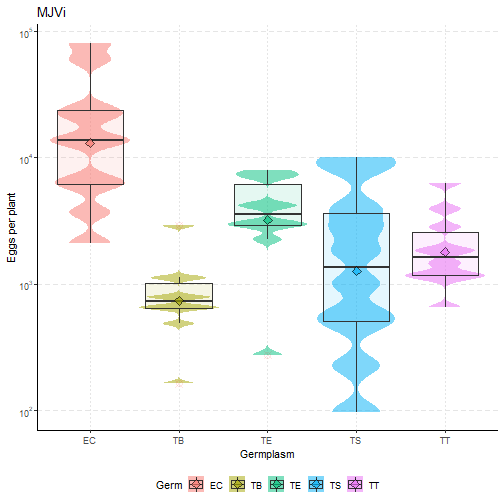

BeamerTest
========================================================
author: Garcia-Mendivil, Helio A.
date: 01 septiembre, 2019
autosize: true
font-family: 'Helvetica'

First Slide
========================================================

For more details on authoring R presentations please visit <https://support.rstudio.com/hc/en-us/articles/200486468>.

- Bullet 1
- Bullet 2
- Bullet 3

Slide With Code
========================================================

Slide With Plot
========================================================
type: section

Slide With Plot 2
========================================================
id: slideplot2
type: prompt

- [linked phrase](http://example.com)

Slide With Plot 3
========================================================

- [Go to slide 1](#/slideplot2)

- [linked phrase](http://example.com)

